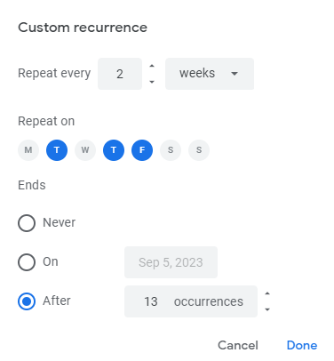
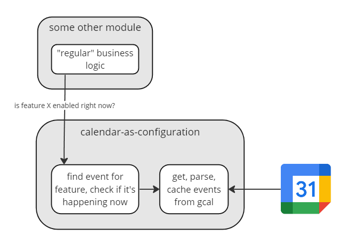
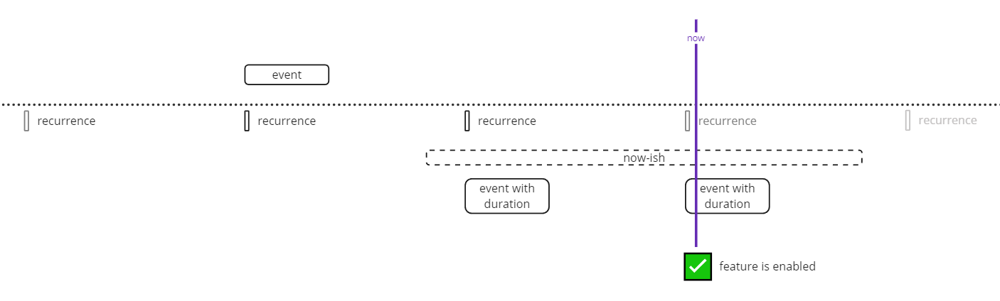
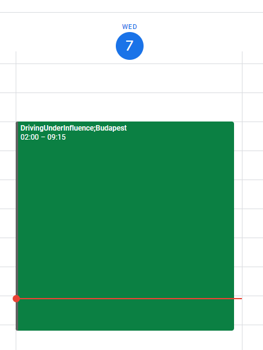

[⬅ Back](/) 

# Using Google Calendar for time-based rules

Back at TIER, we've been doing workarounds for having time based rules in the system for years. Prohibited zones that are only active during the weekends, prompts in the app are only available in the evening, *some other example* were all the company wished very hard for, but engineers kept pushing it back, since it's pretty complex, as I'm going to show in a minute.
We had a problem this time, because this time, we **even** **more** definitely wanted to have a prompt in the app, for a driving-under-influence prevention feature, and showing that only made sense in the evenings. This is how we solved it.

___

## Pain

Driving under influence is a problem with electric scooters, so we wanted to introduce a way to raise some awareness. Our designers created multiple prototypes and we selected the best one, but after interviewing the our city ops and management teams, we found that they definitely didn't want any kind of potentially churn-creating UI element to be shown during the day. For probably the hundredth time, an engineer someone in the company (me) started having panic attacks because the time based configs problem was still not solved, but now we had to find a way to do it.

Basically, we wanted to be able to answer the following question in any time, for any city, for any feature: "Is Feature enabled in City Right Now?" - and hopefully make setting up the answer to this as small a hassle as possible.

We sat down to the drawing board and came up with some rules our city operations teams might think of:

- every day from 5pm to 11pm (sounds simple enough)
- friday to sunday all day (so we need to be able to define only some days, okay)
- friday to sunday, from 5pm to 11pm (so we need to be able to define only some times too, still sounds sensible)
- friday to sunday 10pm to 3am (is that friday 10pm-midnight, and saturday midnight-3am? are the daily rules overlapping?)
- friday to sunday, 10pm to 3am, except every second week it's thursday to sunday (do we need biweekly repetitions?)
- friday and saturday, 10pm to 3am, sunday 10pm to 1am only because next day people work (how many different rules is this???)
- friday to sunday, 10pm to 3am, except on May 11th in 2023 because the next day is a working day (do we need to make some set-intersection logic????)
- August 13th 5pm to August 20th 5pm continuously since there's a festival (okay but during that do we still need the friday-sunday rule?)
- a single hour on a single saturday afternoon since there's a big match (what about all the other rules though???)

And I've created this list in the evening while writing this article, so you can imagine how large the imaginable space of these rules could be. From any time to any time, with any custom repetition and exclusions and extensions and YIKES.

___

### It gets complicated

For the first few examples, a specification where you define a time and a set of days could make sense (excuse the pseudo-YAML):

```
timeStart: 5pm
timeEnd: 11pm
days: fri, sat, sun
```

But what do you do with rules reaching over midnight? You could have multiple rules, and just go over all of them and see if one applies:

```
rules:
  - timeStart: 10pm
    timeEnd: 12am
    days: fri, sat, sun
  - timeStart: 12am
    timeEnd: 3am
    days: sat, sun, mon
```

This almost covers everything within a single week. We still need to introduce exclusions and one-off extensions - with those, you can cover biweekly repetitions too:

```
rules:
  - timeStart: 10pm
    timeEnd: 12am
    days: fri, sat, sun
  - timeStart: 12am
    timeEnd: 3am
    days: sat, sun, mon
  - timeStart: 12am
    timeEnd: 3am
    days: mon
    exclude: true
  - timeStart: 12am
    timeEnd: 3am
    date: 2023-05-11
```

It gets messy, and it's hard to understand what's happening at a glance. We didn't even discuss the implementation, but you think about configuring this every time, and changing that configuration. This is where you start to really panic and invoke upon the might of the team's PM to ask cities to maybe please just be NORMAL, and let us introduce some constraints, but cities realllllly want to show a screen in the app for their one-off football game.

___

### It gets... simple?

There's one tool which handles this kind of time complexity really well though: _calendars_. Just picture Google Calendar: you can create any kind of event length, with a lot of options to repeat them, do one-off exclusions on the repeated occurrences, do one-off events, have overlapping rules - it's all we ever wanted. Google Calendar provides a super nice UI to modify your events, with a recurrence editor too.



Google Calendar uses a standard format for storing these event details, called iCalendar ([RFC5545](https://datatracker.ietf.org/doc/html/rfc5545)), which comes along with a spec for [recurrence rules (RRULE)](https://datatracker.ietf.org/doc/html/rfc5545#section-3.3.10). Google Calendar (and most other calendar tools) gives you a way to export your events in this format (and maybe even stores the events in iCal in the first place). What's even better, you can get a "Secret address in iCal format" under the calendar sharing settings, which is basically a secret, passwordless HTTP GET endpoint that you can download the iCal from.

[I found a post while researching the subject that resonated a lot](https://mamchenkov.net/wordpress/2017/11/21/rrule-will-make-you-hate-calendars/):

 > Starting with the most basic rules of repeating every day, and going into complete insanity of repeating every other Thursday, starting from next week and until the beginning of next year every other month, RRULEs can drive even the calmest of people completely insane.

What I get from this post though that it was probably written with the frustration of being on the implementing side of a calendar client. If you're not looking to implement a calendar though, and have some lib to parse RRULES? You can connect your Google Calendar as a client, the "database" it edits is the list of all events,then create events that match a feature name, read the events, read their RRules, decide if the current time intersects a recurrence of an event, and you're golden.



___

## How it works

A feature then becomes an event. Any audience groups or cohorts, that you want to time the feature differently for (in our example, cities) go into the title or the description, or wherever (something like `event name: Driving Under Influence;Budpapest`).

I set up some 5 minute polling in the service that wanted to rely on this config, that downloads the iCal as text, and used [ical](https://www.npmjs.com/package/ical) to parse the file; this being a node service, but I'm sure other languages have iCal implementations too.

Whenever the big question arrives - asking whether *Driving Under Influence* should be enabled in *Budapest*, *Right Now* - the following happens:
- Find the event for that Feature and City, get its start time, duration and rrule,
- Using [rrule.js](https://www.npmjs.com/package/rrule), parse the RRULE, and generate the valid occurrences that are *now-ish* using `rruleSet.between`. 
  - For *now-ish* I used the start and end of the current day, but this was completely arbitrary, it just has to contain the current moment,
- Since this only generates the start time of the event, turn any recurrences the previous step generated into a range by adding the duration to each of them,
- Check if current time is in the bounds of any of the generated events,
- If you find any, the feature is enabled ✅



The whole logic is not too complicated if you don't think about it too hard - **and you don't have to**, since Google Calendar, and iCal, and these wonderful libs abstract away all the gory details of how RRULEs need to be set up, and how you can generate all the occurrences.

___

## Feels good

From a maintainability perspective, this is pretty good, since there's only one dependency, which is the "database" of your events in Google Calendar, which is hosted by Google - and even if they go down, we have a cache that can serve all current recurrences too even weeks later.

If for some reason we want to change any components, it's simple to do so: 

- Google Calendar can be swapped to any other calendar software and we still keep the ical format and the rest of the backend,
- The backend implementation itself is almost trivial, and can be moved between services, extracted on it's own, put into an SDK, rewritten to other languages, any of this within a day's effort.

From a usability perspective, it's even better: we can just **hand out the calendar** to the city operations managers themselves so they can directly set up the events they want, and they can also see through what's enabled at the moment, since your calendar gives you an accurate picture of what event(s) you have happening at any moment. No hassle in setting it up, no hassle in understanding it. **You actually give the tool to people to configure their stuff ON AN INTERFACE THAT'S ALREADY FAMILIAR TO THEM**. If there's one major win in this whole idea, it's this.




